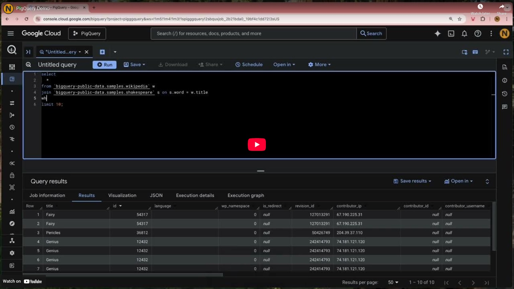
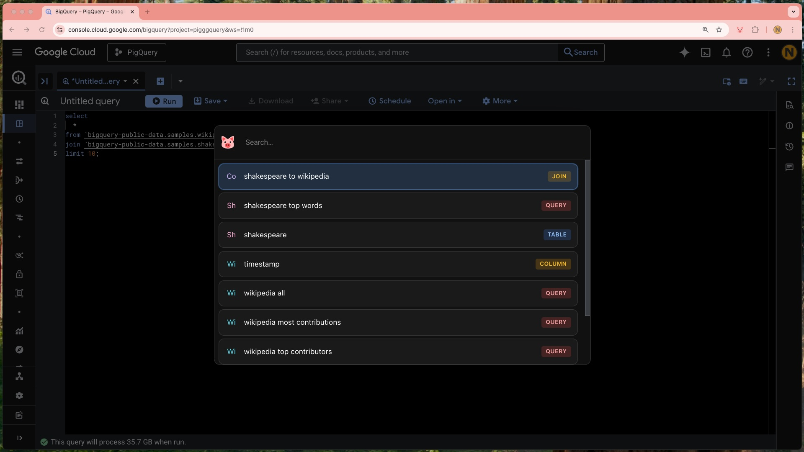
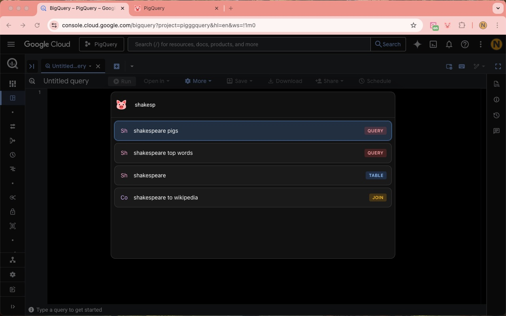
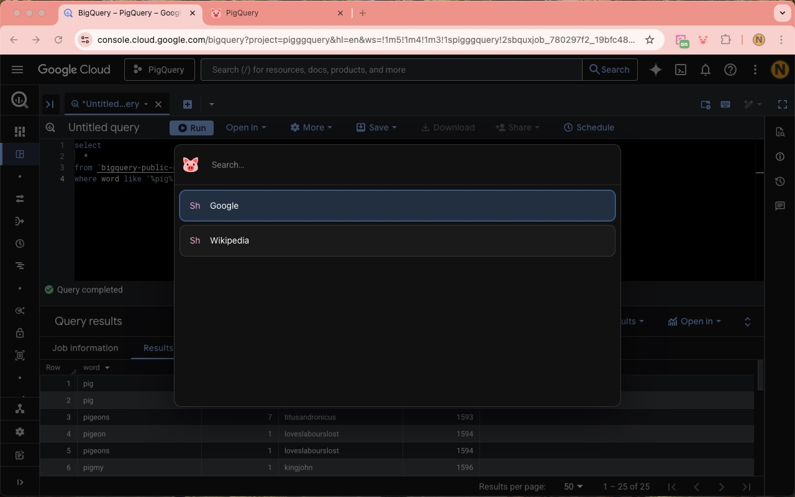
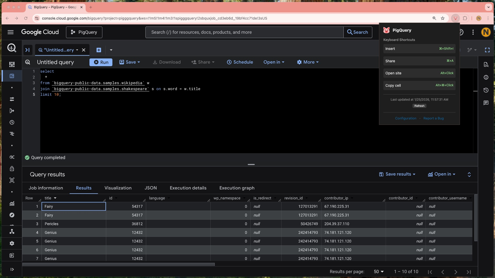

# <picture></img></picture> PigQuery

## Intro

A Chrome Extension offering some BigQuery enhancements.

## Features

- Insert saved queries and query snippets.
- Share queries via URL without saving.
- Open external sites related to table cell data.
- Copy table cell content to clipboard.

## Screenshots

     

