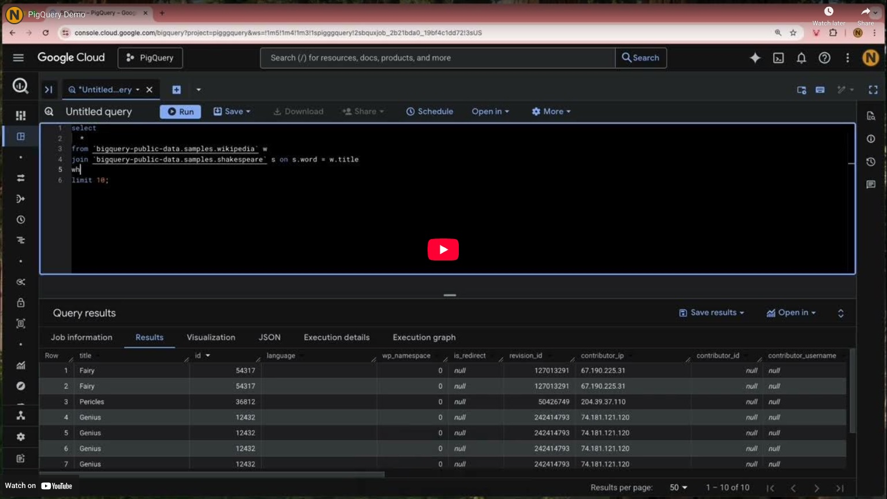
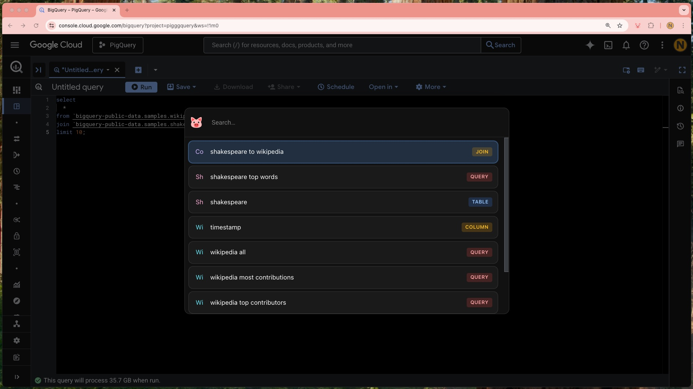
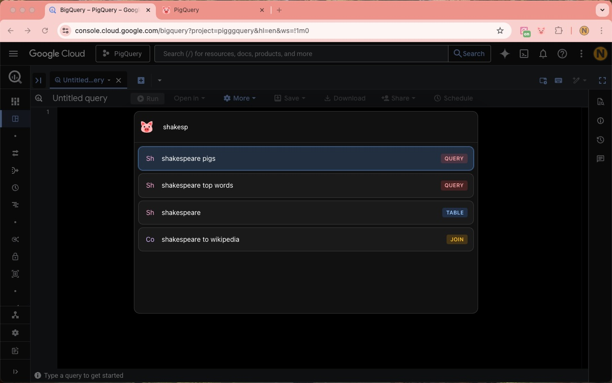
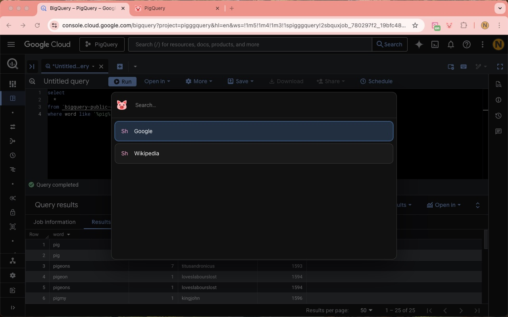
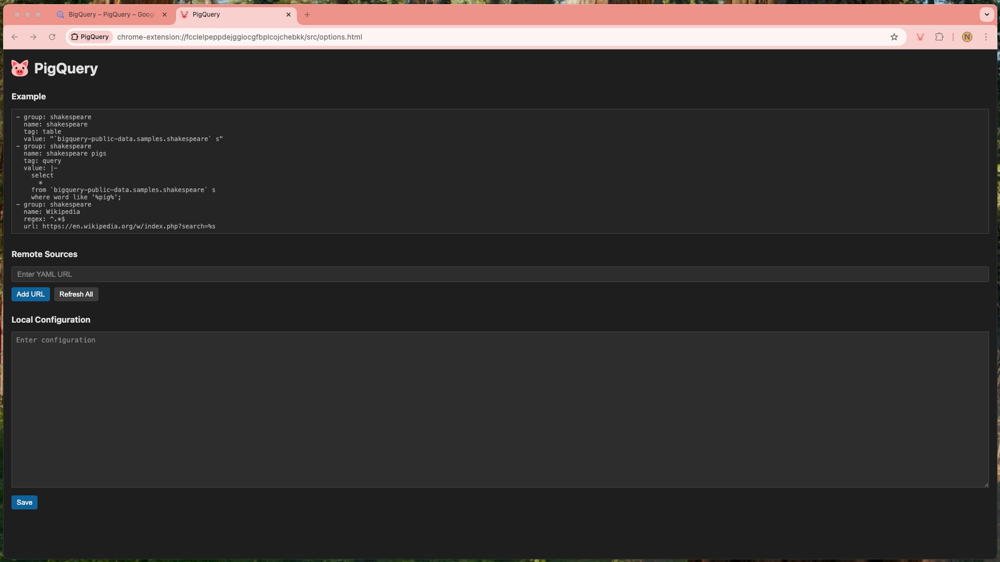
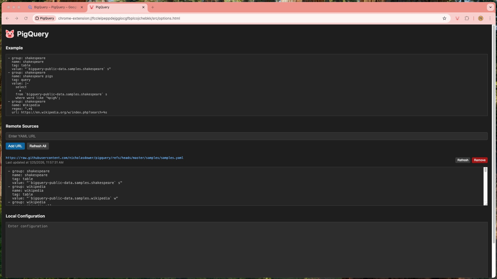
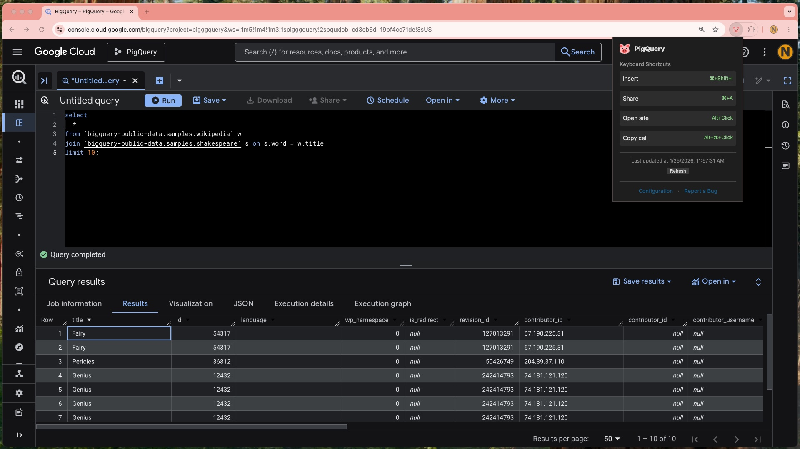

# <picture></img></picture> PigQuery

## Intro

A Chrome Extension offering some BigQuery enhancements.

[](https://www.youtube.com/watch?v=wgEkK5jHHaM)

## Features

- Insert saved queries and query snippets.
- Share queries via URL without saving.
- Open external sites related to table cell data.
- Copy table cell content to clipboard.
- Parse/format table cell content.

## Screenshots

     

## Development

### Recording Demo Videos

To record demo videos of the extension in action:

1. Install Playwright:
   ```bash
   npm install
   npx playwright install ffmpeg
   ```

2. Set up a local Chrome profile for testing (first time only):
   ```bash
   /Applications/Google\ Chrome.app/Contents/MacOS/Google\ Chrome --remote-debugging-port=9222 --user-data-dir="`pwd`/profile"
   ```
   - Log in to BigQuery
   - Load the extension (chrome://extensions → Load unpacked → select this project directory)
   - Keep Chrome running but close all tabs

3. Run the demo script:
   ```bash
   node scripts/record-demo.js
   ```

The script will connect to your running Chrome instance, navigate to BigQuery, perform automated actions, and save a video to the `videos/` directory and a screenshot to `screenshots/`.

**Note:** For subsequent runs, repeat steps 2 and 3. The profile will be saved locally in the `profile/` directory.

